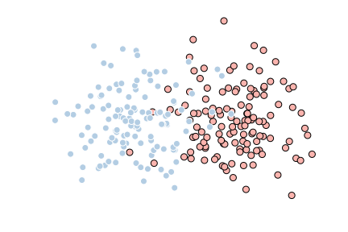
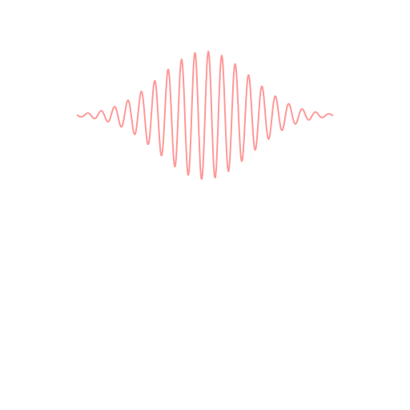

Ideal measurements are strong
-----------------------------

Common introduced using "observables"

Real measurements have weakness
-------------------------------

Real measurements have weakness
-------------------------------

Stern--Gerlach

Real measurements have weakness
-------------------------------

Transition-edge sensor

Measurements are fuzzy processes
--------------------------------

Outcomes are not definitive, and information flows continuously.

Formalism for fuzzy measurements
--------------------------------

Kraus operators and POVMs

POVMs give nice weakness criteria
---------------------------------

Almost all measurement outcomes are uninformative

"Most" of the POVM is "close" to identity

Is weakness useful for characterization?
----------------------------------------

Novelty, efficacy, and significance capture utility
---------------------------------------------------

Does weakness allow us to do something we couldn't otherwise do?

Does weakness allow us to do something better than we have previously?

Does weakness provide insight?

Das and Arvind
--------------

Story about extracting some information and then extracting more information
obscures how much is actually being learned about the system.

Distilling the problem to its essence reveals more clearly what information
is coming from the system (the POVM is a random ODOP).

Direct state tomography
-----------------------

Postselection clouds rather than clarifies (use Kraus operator expressions
(4.17) through (4.19) and the circuit Fig. 4.4 to illustrate).

Amplitudes are not showing up "point by point" on the measuring device.

The prospect of measuring without disturbing the system should be taken with a
grain of salt.

Formalism for continuous measurements
-------------------------------------

Kraus operators for state update

Field formalism
---------------

All the approximations!

Homodyne measurement in qubit picture
-------------------------------------

$$dB_t^\dagger+dB_t\propto\sigma_x$$

Spin-coherent-state measurement
-------------------------------

Interaction circuit

$$U_{t,t+dt}=I+\sqrt{\gamma}\mathbf{J}\cdot(d\mathbf{B}_t^\dagger
-d\mathbf{B}_t)+\tfrac{1}{2}\gamma dt\Vert\mathbf{J}\Vert^2$$

Gaussian white-noise
--------------------

$$\langle dB_t\rangle=\beta_tdt$$
$$\langle dB_t^\dagger dB_t\rangle=Ndt$$
$$\langle dB_tdB_t\rangle=Mdt$$
$$\langle[dB_t,dB_t^\dagger]\rangle=dt$$

Mean fields are small rotations
-------------------------------

Bloch sphere picture of the rotation

Thermal fields are thermal qubits
---------------------------------

Bloch sphere picture of thermal state

Mention how the effective coupling increases in strength

Squeezed fields are modified couplings/measurements
---------------------------------------------------

Show how correlations between quadratures translates into redefinition of $x$
and $y$ to quadratures that are correlated in vacuum

Photon counting in the presence of squeezing
--------------------------------------------

Infinite photon flux in the broadband case

Squeezed wavepackets have finite bandwidth
------------------------------------------

Squeezed wavepackets have temporal correlations
-----------------------------------------------

We won't get a Markovian master equation

Temporal decomposition
----------------------

