Ideal measurements are strong
-----------------------------

Common introduced using "observables"

Real measurements have weakness
-------------------------------

Formalism for fuzzy measurements
--------------------------------

$$K_j=\langle o_j|U(\epsilon)|\phi\rangle$$

$$|\psi^\prime\rangle\propto
\langle o_j|U(\epsilon)|\psi\rangle\!\otimes\!|\phi\rangle
=K_j|\psi\rangle$$

Formalism for fuzzy measurements
--------------------------------

$$E_j=K_j^\dagger K_j$$

$$\operatorname{Pr}(o_j|\psi)
=\operatorname{tr}[K_j|\psi\rangle\langle\psi|K_j^\dagger]
=\operatorname{tr}[E_j|\psi\rangle\langle\psi|]$$

POVMs give nice weakness criteria
---------------------------------

Almost all measurement outcomes are uninformative

"Most" of the POVM is "close" to identity

$$\sum_{E\approx\lambda\mathbb{1}}E\approx\mathbb{1}$$

Judge utility by 3 criteria
---------------------------

1. Novelty
2. Efficacy
3. Significance

Novelty is useful
-----------------

Does weakness allow us to do something we couldn't otherwise do?

Efficacy is useful
------------------

Does weakness allow us to do something better than we have previously?

$$f(\rho,\sigma)=\operatorname{tr}\sqrt{\!\sqrt{\!\rho}\,\sigma\sqrt{\!\rho}},
\quad
\hat{\rho}:\mathtt{data}\mapsto\hat{\rho}(\mathtt{data}),$$
$$\operatorname{Pr}(\mathtt{data})=
\operatorname{tr}[dE(\mathtt{data})\sigma],$$
$$F(dE)=\max_{\hat{\rho}}\mathbb{E}_{\mathtt{data}}\left[\mathbb{E}_\sigma\left(
f[\hat{\rho}(\mathtt{data}),\sigma]\right)\right].$$

Significance is useful
----------------------

Does weakness provide insight?

Das and Arvind
--------------

Story about extracting some information and then extracting more information
obscures how much is actually being learned about the system.

Distilling the problem to its essence reveals more clearly what information
is coming from the system (the POVM is a random ODOP).

Das and Arvind
--------------

Das and Arvind
--------------

Das and Arvind
--------------

Das and Arvind
--------------

Direct state tomography
-----------------------

Postselection clouds rather than clarifies (use Kraus operator expressions
(4.17) through (4.19) and the circuit Fig. 4.4 to illustrate).

Amplitudes are not showing up "point by point" on the measuring device.

The prospect of measuring without disturbing the system should be taken with a
grain of salt.

Direct state tomography
-----------------------

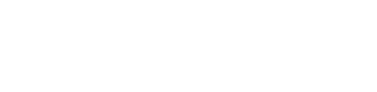

Direct state tomography
-----------------------

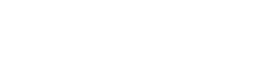

Direct state tomography
-----------------------

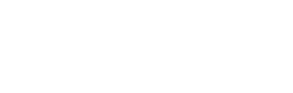

Continuous measurements are weak
--------------------------------

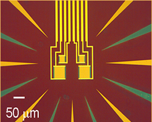

Continuous measurements are weak {data-background-image="img/tes-background.png"}
--------------------------------

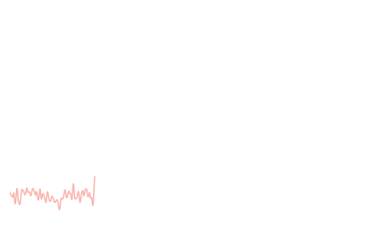

Continuous measurements are weak {data-background-image="img/tes-background.png"}
--------------------------------

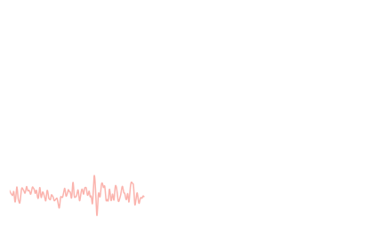

Continuous measurements are weak {data-background-image="img/tes-background.png"}
--------------------------------

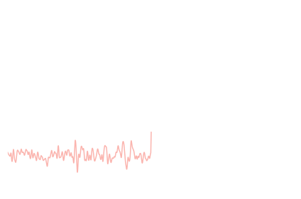

Continuous measurements are weak {data-background-image="img/tes-background.png"}
--------------------------------

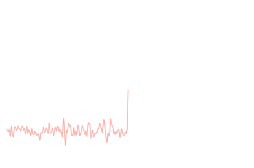

Continuous measurements are weak {data-background-image="img/tes-background.png"}
--------------------------------

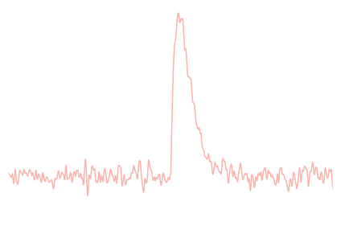

Inputs and outputs
------------------

Inputs and outputs
------------------

Formalism for continuous measurements
-------------------------------------

$$\Delta\rho_{n|j}=\frac{K_j\rho_nK_j^\dagger}{\operatorname{tr}(E_j\rho_n)}
-\rho_n$$

White noise {data-background-image="img/white-noise-background.png"}
-----------

Approximations

1. Rotating wave (RWA)
2. Quasimonochromatic
3. 1ˢᵗ Markov
4. 2ⁿᵈ Markov

Quasimonochromatic and RWA {data-background-image="img/white-noise-background.png"}
--------------------------

$$\Omega^{-1}\ll\Delta t\ll\gamma^{-1}$$

$$H_I^{(n)}=\sqrt{\frac{\gamma}{\Delta t}}\left(c\!\otimes\!b_n^\dagger
-c^\dagger\!\otimes\!b_n\right)$$

1st Markov {data-background-image="img/white-noise-background.png"}
---------------------

$$\Delta x\ll c\Delta t$$

1ˢᵗ Markov {data-background-image="img/white-noise-background.png"}
----------

$$\Delta x\ll c\Delta t$$

2ⁿᵈ Markov {data-background-image="img/white-noise-background.png"}
----------

$$\tau_c\ll\Delta t$$

All approximations {data-background-image="img/white-noise-background.png"}
------------------

-------------------------------------- --------------------------
$\Delta x\ll c\Delta t$                First Markov
$\tau_c \ll \Delta t$                  Second Markov
$\Omega^{-1}\ll\Delta t\ll\gamma^{-1}$ RWA and quasimonochromatic
-------------------------------------- --------------------------

Markovian circuit {data-background-image="img/white-noise-background.png"}
-----------------

Unitary
-------

$$\begin{multline}
U_I^{(n)}=\mathbb{1}+\Delta tH_I^{(n)}+\tfrac{1}{2}\Delta t^2H_I^{(n)}^2
\\
=\mathbb{1}
+\sqrt{\gamma\Delta t}(c\!\otimes\!b_n^\dagger-c^\dagger\!\otimes\!b_n)
\\
+\tfrac{1}{2}\gamma\Delta t(c\!\otimes\!b_n^\dagger
-c^\dagger\!\otimes\!b_n)^2
\end{multline}$$

Quantum noise
-------------

$$dB_t=\int_t^{t+dt}\!ds\,b_s$$

$$\Delta B_n=\Delta t\frac{b_n}{\sqrt{\Delta t}}=\sqrt{\Delta t}\,b_n$$

Vacuum
------

Single photon population within $\Delta t$ mode is small. Higher photon
populations are negligible.

$$dB_tdB_t^\dagger=dt$$

$$dB_tdB_t=dB_t^\dagger dB_t=dB_t^\dagger dB_t^\dagger=0$$

Vacuum
------

Since we only care about 0 or 1 photon in the mode, each $\Delta t$ mode is
effectively a qubit:

$$\Delta B_n=\sqrt{\Delta t}\,\sigma_-$$

Unitary (revisited)
-------------------

$$\begin{multline}
U_I^{(n)}=\mathbb{1}+\sqrt{\gamma}(c\!\otimes\!\Delta B_n^\dagger
-c^\dagger\!\otimes\!\Delta B_n)
\\
-\tfrac{1}{2}\gamma\Delta t\,c^\dagger c
\end{multline}$$

Homodyne measurement in qubit picture
-------------------------------------

$$dB_t^\dagger+dB_t$$
$$\Delta B_n+\Delta B_n^\dagger=\sqrt{\Delta t}(\sigma_-+\sigma_+)
\propto\sigma_x$$

Spin-coherent-state measurement
-------------------------------

Interaction circuit

$$U_{t,t+dt}=I+\sqrt{\gamma}\mathbf{J}\cdot(d\mathbf{B}_t^\dagger
-d\mathbf{B}_t)+\tfrac{1}{2}\gamma dt\Vert\mathbf{J}\Vert^2$$

Gaussian white-noise
--------------------

$$\langle dB_t\rangle=\beta_tdt$$
$$\langle dB_t^\dagger dB_t\rangle=Ndt$$
$$\langle dB_tdB_t\rangle=Mdt$$
$$\langle[dB_t,dB_t^\dagger]\rangle=dt$$

Mean fields are small rotations
-------------------------------

$$|\beta\rangle=D(\beta)|g\rangle=(1-\tfrac{1}{2}|\beta|^2dt)|g\rangle
+\beta\sqrt{dt}|e\rangle$$

$$D(\beta)=\exp\!\left(\beta\sqrt{dt}\,\sigma_+
-\beta^*\sqrt{dt}\,\sigma_-\right)$$

Thermal fields are thermal qubits
---------------------------------

$$\sigma_{\text{th}}=\tfrac{N}{2N+1}|e\rangle\langle e|
+\tfrac{N+1}{2N+1}|g\rangle\langle g|$$

$$\gamma_N=(2N+1)\gamma$$

Squeezed fields are modified couplings/measurements
---------------------------------------------------

Squeezed fields are modified couplings/measurements
---------------------------------------------------

Squeezed fields are modified couplings/measurements
---------------------------------------------------

Photon counting in the presence of squeezing
--------------------------------------------

Infinite photon flux in the broadband case

$$\langle b_tb_s\rangle=M\delta(t-s)$$
$$\langle \tilde{b}_\Omega\tilde{b}_{\Omega-\omega}\rangle=\text{constant}$$

Photon counting in the presence of squeezing
--------------------------------------------

Need restrict the bandwidth of the squeezing

Squeezed wavepackets
--------------------

$$S_\gamma[\xi]=\exp\left[\tfrac{1}{2}\left(\gamma^*B[\xi]^2
-\gamma B^\dagger[\xi]^2\right)\right]$$

$$B[\xi]=\int dt\,\xi^*_tb_t$$

Squeezed wavepackets have temporal correlations
-----------------------------------------------

$$\langle b^\dagger_tb_s\rangle=\xi_t\xi^*_sN$$
$$\langle b_tb_s\rangle=\xi_t^*\xi_s^*M$$

Temporal decomposition
----------------------

$N$-photon wavepacket

$$\begin{multline}
\left|N_\xi\right\rangle=(1-\tfrac{1}{2}|\xi_t|^2dt)\left|0_t\right\rangle
\!\otimes\!\left|N_{\overline{t}}\right\rangle+
\\
\xi_t\sqrt{N\,dt\,}\left|1_t\right\rangle
\!\otimes\!\left|(N-1)_{\overline{t}}\right\rangle
\end{multline}$$

Temporal decomposition
----------------------

$$S_\gamma[\xi]=e^XS_\gamma[\overline{t}]e^{-X}$$

$$X=-\xi^*_tdB_tB[\overline{t}]^\dagger+\xi_tdB_t^\dagger B[\overline{t}]$$

Temporal decomposition
----------------------

$$\begin{multline}
\left|N_{\gamma,\xi}\right\rangle=\left|N_t\right\rangle\!\otimes\!
\left(\left|N_{\gamma,\overline{t}}\right\rangle+
dt\left|\tilde{\psi}_{dt}\right\rangle\right)+
\\
\xi_t\sqrt{dt}\left|1_t\right\rangle
\!\otimes\!\left(c\sqrt{N}\left|(N-1)_{\gamma,\overline{t}}\right\rangle+\right.
\\
\left.se^{2i\mu}\sqrt{N+1}\left|(N+1)_{\gamma,\overline{t}}\right\rangle\right)
\end{multline}$$

System state
------------

$$\rho_{t|\mathbf{R}}=\frac{\operatorname{tr}_{[t,\infty)}
\Big[C_{\mathbf{R}}\big(\rho_0\otimes|0_{\gamma,\xi}\rangle
\langle0_{\gamma,\xi}|\big)
C_{\mathbf{R}}^\dagger\Big]}{\operatorname{Pr}(\mathbf{R})}$$
$$C_{\mathbf{R}}=\langle\mathbf{R}|U_{0,t}\otimes\mathbb{1}_{[t,\infty)}$$

"Bookkeeping" states
--------------------

$$\rho_{t|\mathbf{R}}^{(m,n)}=\frac{\operatorname{tr}_{[t,\infty)}
\Big[C_{\mathbf{R}}\big(\rho_0\otimes|m_{\gamma,\xi}\rangle
\langle n_{\gamma,\xi}|\big)
C_{\mathbf{R}}^\dagger\Big]}{\operatorname{Pr}(\mathbf{R})}$$
$$C_{\mathbf{R}}=\langle\mathbf{R}|U_{0,t}\otimes\mathbb{1}_{[t,\infty)}$$

Photon-counting evolution
-------------------------

Number couples &leftarrow; and &downarrow;
------------------------------------------

$$d\rho_{t|\mathbf{R}}^{(m,n)}=f\left(\rho_{t|\mathbf{R}}^{(m,n)},
\rho_{t|\mathbf{R}}^{(m-1,n)},\rho_{t|\mathbf{R}}^{(m,n-1)},
\rho_{t|\mathbf{R}}^{(m-1,n-1)}\right)$$

Squeezed couples &leftarrow;, &rightarrow;, &downarrow;, &uparrow;!
-------------------------------------------------------------------

$$d\rho_{t|\mathbf{R}}^{(m,n)}=f\left(\rho_{t|\mathbf{R}}^{(m,n)},
\rho_{t|\mathbf{R}}^{(m-1,n-1)},\ldots,
\rho_{t|\mathbf{R}}^{(m+1,n+1)}\right)$$

Simulation requires truncation
------------------------------

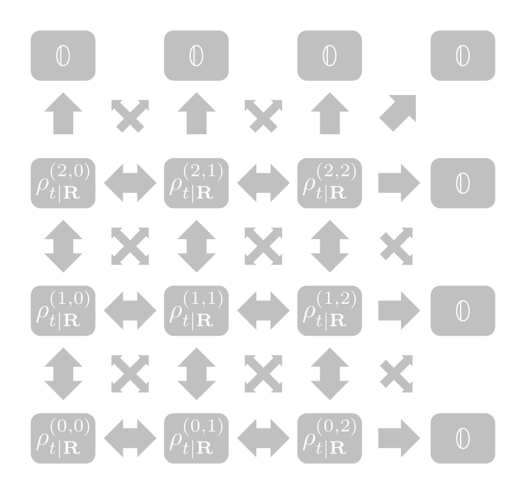

$m\geq n_{\text{max}}$ or $n\geq n_{\text{max}}$:

$$\rho_{t|\mathbf{R}}^{(m,n)}=\mathbb{0}$$

Need to compare truncations
---------------------------

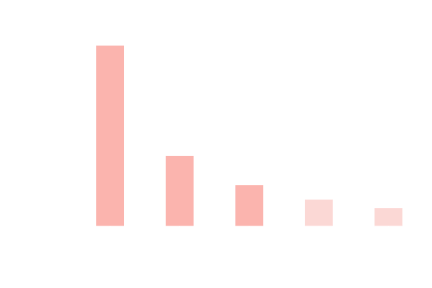

Number hierarchy: exact evolution for approximate initial state

Need to compare truncations
---------------------------

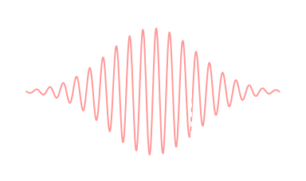

Squeezed hierarchy: exact initial state, approximate evolution

&nbsp; {data-background-image="img/medium-wavepacket-convergence-rates.svg"}
------
