Measurements are questions
--------------------------

Answers are random and depend on the configuration of the world.

The world reconfigures itself to act consistently with its answers.

We can ask precise questions
----------------------------

Possible answers $\{o_1,o_2,\ldots\}$

World configuration $|\psi\rangle$:

$$\operatorname{Pr}(o_j|\psi)=|\langle o_j|\psi\rangle|^2$$

Reconfiguration:

$$|\psi\rangle\overset{o_j}{\rightarrow}|o_j\rangle$$

We can ask imprecise questions
------------------------------

Want to know: did the atom follow the [**red**]{.red} or the [**blue**]{.blue}
arrow?

Ask: did the atom hit the top or bottom half of the screen?

All measurements have imprecision
---------------------------------

*Precise* measurements are **strong**, *imprecise* measurements are **weak**.

How do we describe weak measurements?

Use an ignorant messenger
-------------------------

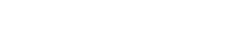

Kraus operator: $K_j=\langle o_j|U(\epsilon)|\phi\rangle$.

$$|\psi\rangle\overset{o_j}{\rightarrow}|\psi^\prime\rangle\propto
K_j|\psi\rangle$$

Use an ignorant messenger
-------------------------

Positive-operator-valued measure (POVM):

$$E_j=K_j^\dagger K_j,\quad\operatorname{Pr}(o_j|\psi)
=\operatorname{tr}[E_j|\psi\rangle\langle\psi|]$$

POVMs give nice weakness criteria
---------------------------------

Almost all measurement outcomes are uninformative

"Most" of the POVM is "close" to identity

$$\sum_{E\approx\lambda\mathbb{1}}E\approx\mathbb{1}$$

Learn by asking questions
-------------------------

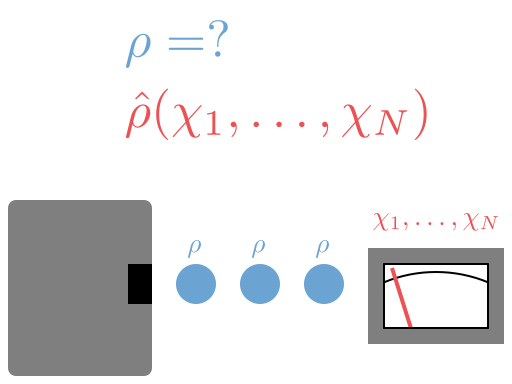

Quantum state tomography learns $\rho$ by polling a large population.

Is it useful to ask imprecise questions?

Precise questions are limited
-----------------------------

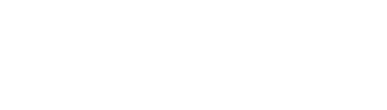

Random projective measurement

Weakness can be a resource
--------------------------

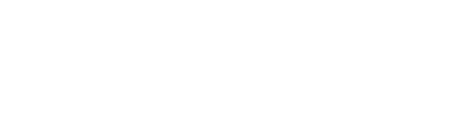

Can measure in ways random projective measurements can't.

Novelty claims abound
---------------------

> This opens up the possibility of new ways of extracting information from
> quantum ensembles.

Novelty claims abound
---------------------

POVM analysis is absent from this and many other proposals, *yet demonstrating
properties like novelty requires such analysis*.

Be the change you want to see
-----------------------------

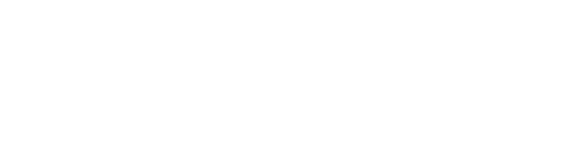

We did the analysis!

Couple to meter
---------------

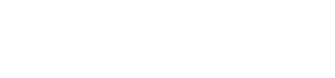

$$|\phi\rangle=
\sqrt[4]{\frac{\epsilon}{2\pi}}\int dq\,e^{-\epsilon q^2/4}|q\rangle$$

Displace wide Gaussians
-----------------------

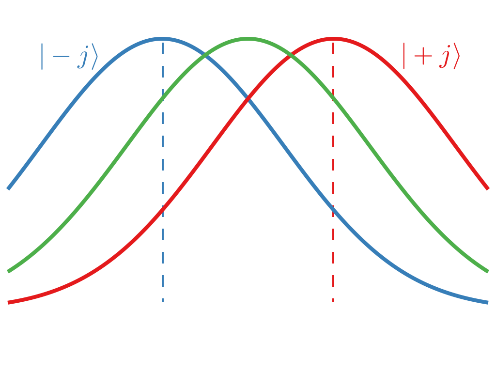

$$K^{(j)}(q)\propto\cosh(\tfrac{1}{2}\epsilon q)\mathbb{1}
+\sinh(\tfrac{1}{2}\epsilon q)\sigma_j$$
$$\epsilon=1/\Delta q^2$$

Compose measurements
--------------------

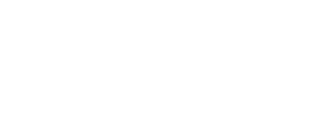

$$\begin{aligned}
K_\pm(q_1,q_2)&=|\pm y\rangle\langle\pm y|K^{(x)}(q_2)K^{(z)}(q_1)
\\
&\propto|\pm y\rangle\langle\phi_\pm(q_1,q_2)|
\end{aligned}$$

POVM is made of projectors
--------------------------

$$dE_\pm(q_1,q_2)=dq_1dq_2D(q_1,q_2)\tfrac{1}{2}(\mathbb{1}
+\hat{\mathbf{n}}_\pm(q_1,q_2)\!\cdot\!\mathbf{\sigma})$$

Elements come in pairs!
-----------------------

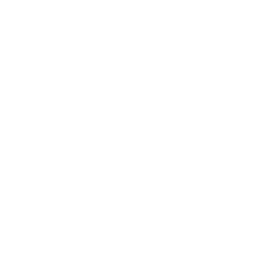

$$\begin{aligned}
D(q_1,q_2)&=D(-q_1,-q_2)
\\
\hat{\mathbf{n}}_\pm(q_1,q_2)&=-\hat{\mathbf{n}}_\mp(-q_1,-q_2)
\end{aligned}$$

Equivalent to random strong measurement
---------------------------------------

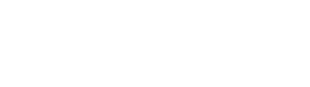

$$d\tilde{E}_\pm(q_1,q_2)=dq_1dq_2D(q_1,q_2)\tfrac{1}{2}(\mathbb{1}
\pm\hat{\mathbf{n}}_+(q_1,q_2)\!\cdot\!\mathbf{\sigma})$$

Represent as hemisphere distribution
------------------------------------

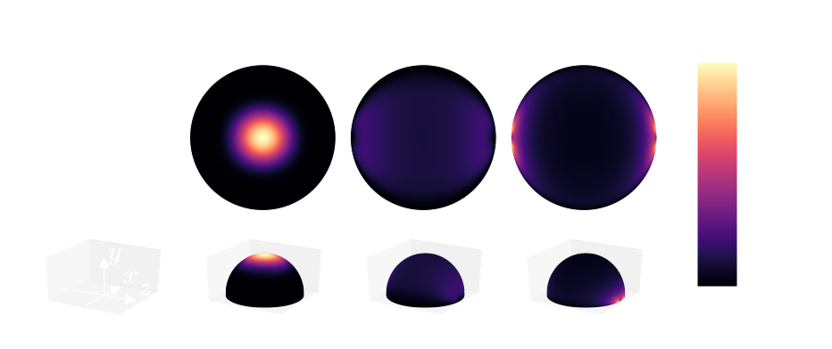

$$d\tilde{E}_\pm(q_1,q_2)=dq_1dq_2D(q_1,q_2)\tfrac{1}{2}(\mathbb{1}
\pm\hat{\mathbf{n}}_+(q_1,q_2)\!\cdot\!\mathbf{\sigma})$$

POVMs show protocol equivalence
-------------------------------

If two protocols give the same measure over positive operators, they yield the
same information content.

Use this strategy to investigate continuous-measurement protocols.

First, what are continuous measurements?

Use a field for continuous measurement
--------------------------------------

&nbsp;

Discretize the field   &nbsp;
---------------------------------

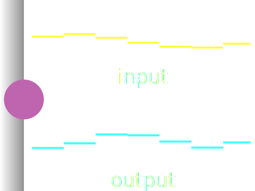

Each segment performs a weak measurement

Get difference equation
-----------------------

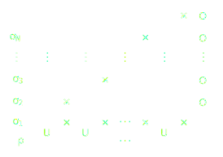

$$\Delta\rho_{n|j}=\frac{K_j\rho_nK_j^\dagger}{\operatorname{tr}(E_j\rho_n)}
-\rho_n$$
When can we do this?

Work in white-noise regime {data-background-image="img/white-noise-background.png"}
--------------------------

Approximations

1. Rotating wave (RWA)
2. Quasimonochromatic
3. 1ˢᵗ Markov
4. 2ⁿᵈ Markov

Quasimonochromatic and RWA {data-background-image="img/white-noise-background.png"}
--------------------------

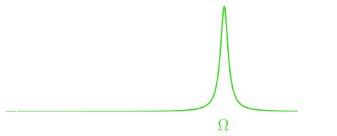

$$\Omega^{-1}\ll\Delta t\ll\gamma^{-1}$$

$$H_I^{(n)}=\sqrt{\frac{\gamma}{\Delta t}}\left(L\!\otimes\!b_n^\dagger
-L^\dagger\!\otimes\!b_n\right)$$

1ˢᵗ Markov {data-background-image="img/white-noise-background.png"}
----------

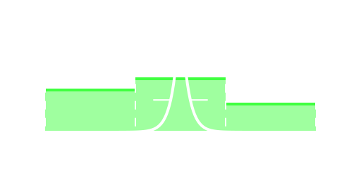

$$\Delta x\ll c\Delta t$$

1ˢᵗ Markov {data-background-image="img/white-noise-background.png"}
----------

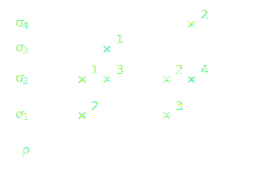

$$\Delta x\ll c\Delta t$$

2ⁿᵈ Markov {data-background-image="img/white-noise-background.png"}
----------

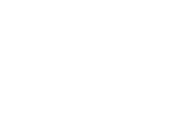

$$\tau_c\ll\Delta t$$

All approximations {data-background-image="img/white-noise-background.png"}
------------------

-------------------------------------- --------------------------
$\Delta x\ll c\Delta t$                First Markov
$\tau_c \ll \Delta t$                  Second Markov
$\Omega^{-1}\ll\Delta t\ll\gamma^{-1}$ RWA and quasimonochromatic
-------------------------------------- --------------------------

Markovian circuit {data-background-image="img/white-noise-background.png"}
-----------------

Use quantum noise increments
----------------------------

Operators encapsulating quantum fluctuations

Continuous and discrete versions

$$\begin{aligned}
dB_t&=\int_t^{t+dt}\!ds\,b_s\quad
\\
\Delta B_n&=\sqrt{\Delta t}\,b_n
\end{aligned}$$

Vacuum simplifies things
------------------------

Single-photon population in $\Delta t$ is small, higher photon numbers
negligible, so each $\Delta t$ mode is effectively a qubit:

$$\begin{aligned}
b_n&\sim\sigma_-^{(n)}
\\
\Delta B_n&\sim\sqrt{\Delta t}\,\sigma_-^{(n)}
\end{aligned}$$

Take qubit picture seriously
----------------------------

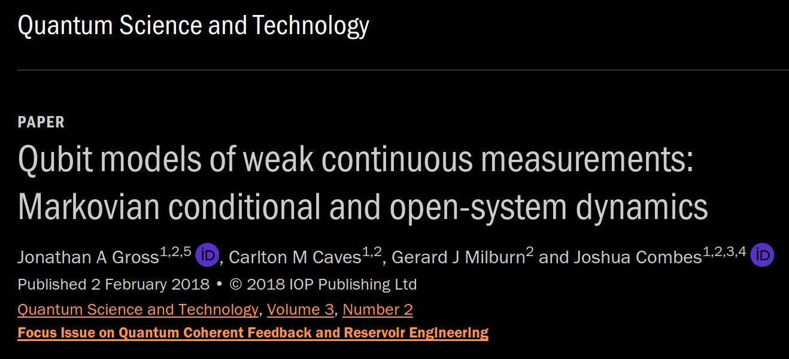

Homodyne &Leftrightarrow; X
---------------------------

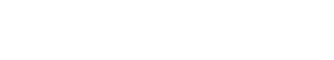

$$dB_t^\dagger+dB_t$$
$$\Delta B_n+\Delta B_n^\dagger=\sqrt{\Delta t}(\sigma_-^{(n)}+\sigma_+^{(n)})
\propto\sigma_x^{(n)}$$

Homodyne &Leftrightarrow; X
---------------------------

$$\begin{aligned}
K_\pm&=\langle\pm|U_I|g\rangle
\\
&=\tfrac{1}{\sqrt{2}}\left(\mathbb{1}\pm\sqrt{\gamma\Delta t}\,c
-\tfrac{1}{2}\gamma\Delta t\,c^\dagger c\right)
\end{aligned}$$

Homodyne is diffusive
---------------------

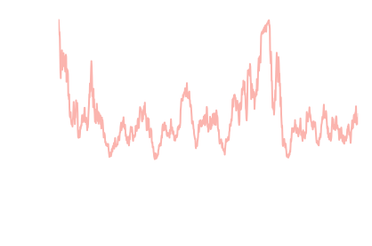

$$\mathbb{E}[dW_t^2]=dt,\quad \int_0^tdW_s\sim\mathcal{N}(0,t)$$

$$\Delta W_n=\operatorname{\pm}_n\sqrt{\Delta t}=
\sqrt{2}\langle\pm|(\Delta B+\Delta B^\dagger)|g\rangle$$

Homodyne gives spin-coherent-state measurement
----------------------------------------------

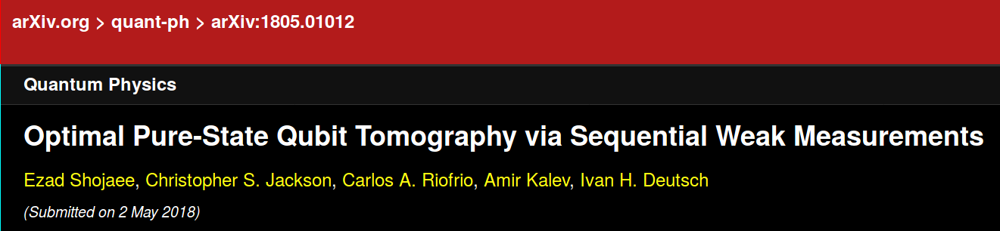

$$\begin{aligned}
U_{t,t+dt}&=I+\sqrt{\gamma}\mathbf{J}\cdot(d\mathbf{B}_t^\dagger
-d\mathbf{B}_t)+\tfrac{1}{2}\gamma dt\Vert\mathbf{J}\Vert^2
\\
&=\mathbb{1}+dU_t
\end{aligned}$$

Quantum noise gives Kraus-operator evolution
--------------------------------------------

$$\begin{aligned}
dK&=\langle\operatorname{\pm}_t^x\operatorname{\pm}_t^y
\operatorname{\pm}_t^z|dU_t|\mathbf{0}_t\rangle K
\\
&\propto\left(\sqrt{\gamma}d\mathbf{W}_t\cdot\mathbf{J}
-\tfrac{1}{2}\gamma dt\Vert\mathbf{J}\Vert^2\right)K
\end{aligned}$$

Solving this allowed Shojaee *et al.* to prove the POVM limits to the
spin-coherent-state POVM.

Provides an example of measurement weakness allowing us to do something new!

How do we move beyond vacuum?
-----------------------------

By being clever with qubits!

Gaussian white noise {data-background-image="img/white-noise-background.png"}
--------------------

$$\langle b_t\rangle=\beta_t$$
$$\langle b_s^\dagger b_t\rangle=N\delta(s-t)$$
$$\langle b_sb_t\rangle=M\delta(s-t)$$
$$\langle[b_s,b_t^\dagger]\rangle=\delta(s-t)$$

Mean fields are small rotations
-------------------------------

$$|\beta\rangle=D(\beta)|g\rangle=(1-\tfrac{1}{2}|\beta|^2dt)|g\rangle
+\beta\sqrt{dt}|e\rangle$$

$$D(\beta)=\exp\!\left(\beta\sqrt{dt}\,\sigma_+
-\beta^*\sqrt{dt}\,\sigma_-\right)$$

Thermal fields are thermal qubits
---------------------------------

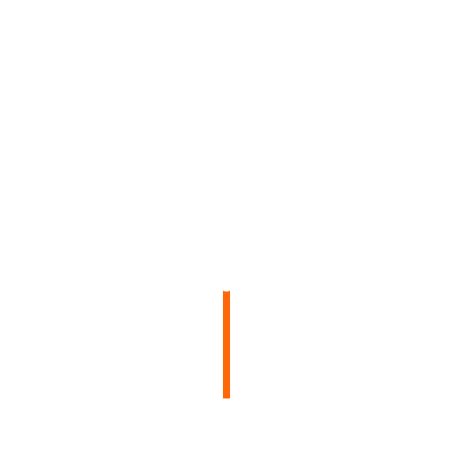

$$\sigma_{\text{th}}=\tfrac{N}{2N+1}|e\rangle\langle e|
+\tfrac{N+1}{2N+1}|g\rangle\langle g|$$

$$\gamma_N=(2N+1)\gamma$$

Squeezed fields are modified couplings/measurements
---------------------------------------------------

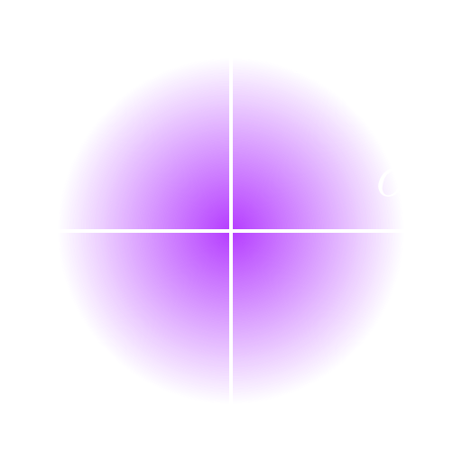

$$\begin{multline}
U_I^{(n)}=\mathbb{1}+\sqrt{\gamma\Delta t}(c\!\otimes\!\sigma_+^{(n)}
-c^\dagger\!\otimes\!\sigma_-^{(n)})
\\
-\tfrac{1}{2}\gamma\Delta t\,c^\dagger c
\end{multline}$$

Squeezed fields are modified couplings/measurements
---------------------------------------------------

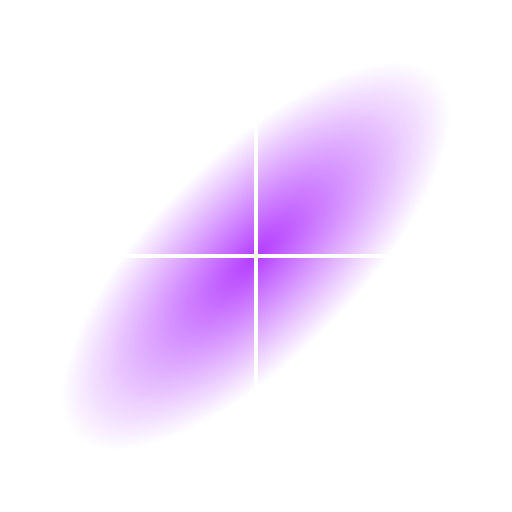

Qubit state space is not rich enough to describe squeezing

Squeezed fields are modified couplings/measurements
---------------------------------------------------

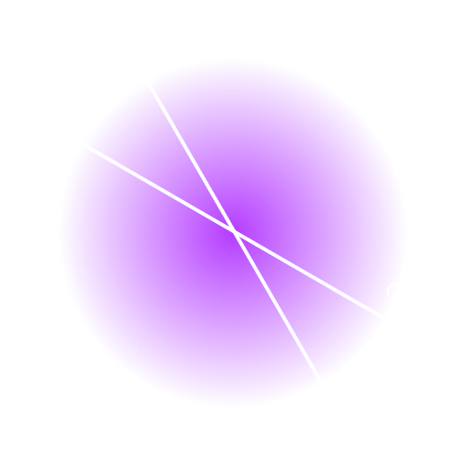

$$\begin{aligned}
\sigma_{x,\text{sq}}&=\sigma_x(\cosh r-\cos2\mu\sinh r)
\\
&\quad+\sigma_y\sin2\mu\sinh r
\end{aligned}$$

Photon counting in the presence of squeezing
--------------------------------------------

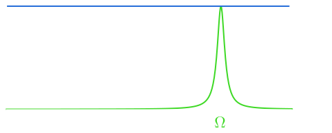

Infinite photon flux in the broadband case

$$\langle b_tb_s\rangle=M\delta(t-s)$$

Photon counting in the presence of squeezing
--------------------------------------------

Infinite photon flux in the broadband case

$$\langle \tilde{b}_\Omega\tilde{b}_{\Omega-\omega}\rangle=\text{constant}$$

Photon counting in the presence of squeezing
--------------------------------------------

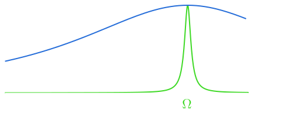

Need restrict the bandwidth of the squeezing

Squeezed wavepackets
--------------------

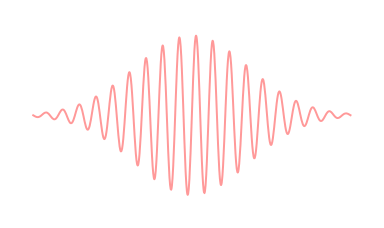

$$S_\gamma[\xi]=\exp\left[\tfrac{1}{2}\left(\gamma^*B[\xi]^2
-\gamma B^\dagger[\xi]^2\right)\right]$$

$$B[\xi]=\int dt\,\xi^*_tb_t$$

Squeezed wavepackets have temporal correlations
-----------------------------------------------

$$\langle b^\dagger_tb_s\rangle=\xi_t\xi^*_sN$$
$$\langle b_tb_s\rangle=\xi_t^*\xi_s^*M$$

System state
------------

$$\rho_{t|\mathbf{R}}=\frac{\operatorname{tr}_{[t,\infty)}
\Big[C_{\mathbf{R}}\big(\rho_0\otimes|0_{\gamma,\xi}\rangle
\langle0_{\gamma,\xi}|\big)
C_{\mathbf{R}}^\dagger\Big]}{\operatorname{Pr}(\mathbf{R})}$$
$$C_{\mathbf{R}}=\langle\mathbf{R}|U_{0,t}\otimes\mathbb{1}_{[t,\infty)}$$

"Bookkeeping" states
--------------------

$$\rho_{t|\mathbf{R}}^{(m,n)}=\frac{\operatorname{tr}_{[t,\infty)}
\Big[C_{\mathbf{R}}\big(\rho_0\otimes|m_{\gamma,\xi}\rangle
\langle n_{\gamma,\xi}|\big)
C_{\mathbf{R}}^\dagger\Big]}{\operatorname{Pr}(\mathbf{R})}$$
$$C_{\mathbf{R}}=\langle\mathbf{R}|U_{0,t}\otimes\mathbb{1}_{[t,\infty)}$$

Use to keep track of system--wavepacket correlations.

Pioneered with number states
----------------------------

Temporal decomposition
----------------------

$N$-photon wavepacket

$$\begin{aligned}
\left|N_\xi\right\rangle&\sim\left|0_t\right\rangle
\!\otimes\!\left|N_{\overline{t}}\right\rangle+
\\
&\quad\,\,\left|1_t\right\rangle
\!\otimes\!\left|(N-1)_{\overline{t}}\right\rangle
\end{aligned}$$

Number couples &leftarrow; and &downarrow;
------------------------------------------

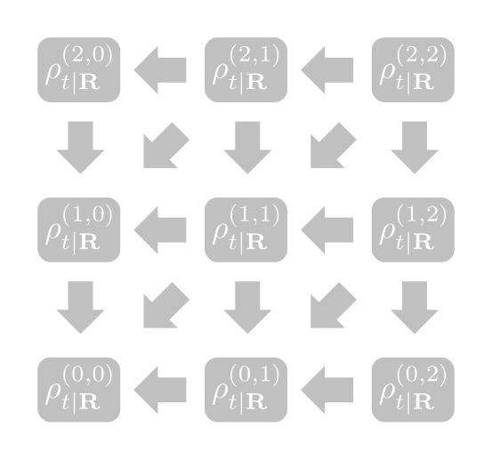

$$\begin{aligned}
d\rho_{t|\mathbf{R}}^{(m,n)}&=f\left(\rho_{t|\mathbf{R}}^{(m,n)},
\rho_{t|\mathbf{R}}^{(m-1,n)},\right.
\\
&\qquad\,\left.\rho_{t|\mathbf{R}}^{(m,n-1)},
\rho_{t|\mathbf{R}}^{(m-1,n-1)}\right)
\end{aligned}$$

Extend to squeezed states
-------------------------

Squeezed decomposition
----------------------

$$S_\gamma[\xi]=e^XS_\gamma[\overline{t}]e^{-X}$$

$$X=-\xi^*_tdB_tB[\overline{t}]^\dagger+\xi_tdB_t^\dagger B[\overline{t}]$$

Squeezed decomposition
----------------------

$$\begin{aligned}
\left|N_{\gamma,\xi}\right\rangle&\sim\left|0_t\right\rangle\!\otimes\!
\left|N_{\gamma,\overline{t}}\right\rangle+
\\
&\quad\,\,\left|1_t\right\rangle
\!\otimes\!\left(\left|(N-1)_{\gamma,\overline{t}}\right\rangle
+\left|(N+1)_{\gamma,\overline{t}}\right\rangle\right)
\end{aligned}$$

Squeezed couples &leftarrow;, &rightarrow;, &downarrow;, &uparrow;!
-------------------------------------------------------------------

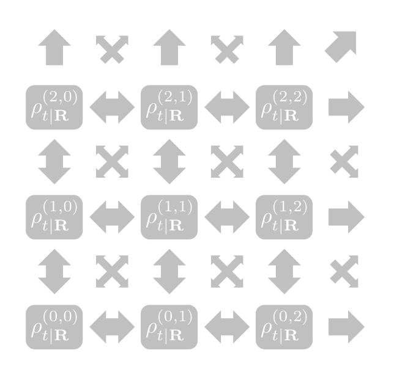

$$d\rho_{t|\mathbf{R}}^{(m,n)}=f\left(\rho_{t|\mathbf{R}}^{(m,n)},
\rho_{t|\mathbf{R}}^{(m-1,n-1)},\ldots,
\rho_{t|\mathbf{R}}^{(m+1,n+1)}\right)$$

Apply to resonance fluorescence
-------------------------------

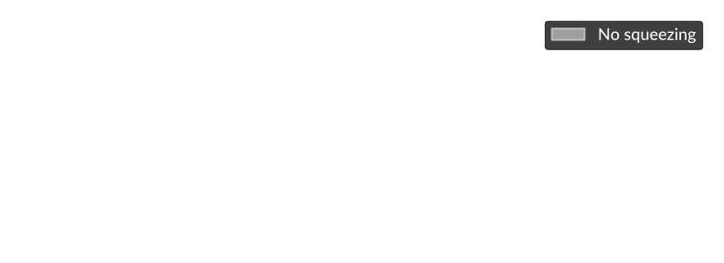

Drive a two-level atom with strong coherent field.

Previous analysis for broadband squeezing
-----------------------------------------

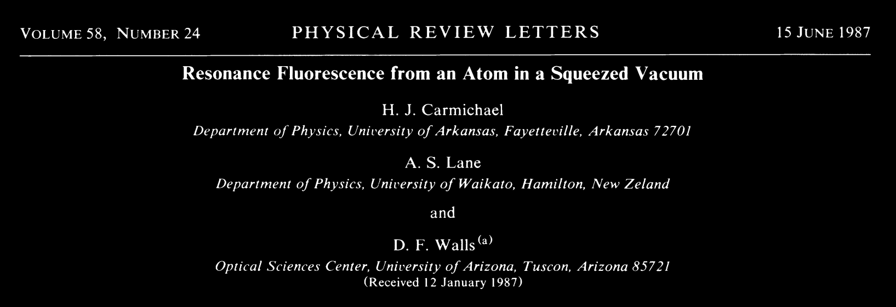

Previous analysis for "narrow"-bandwidth squeezing
--------------------------------------------------

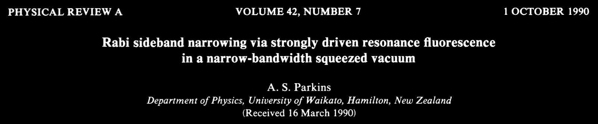

We probe narrow-band regime
---------------------------

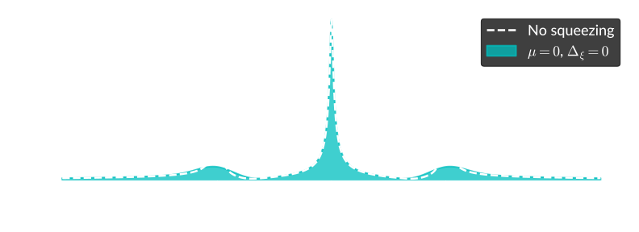

Squeeze phase &Rightarrow; broaden sidebands

$$T=4\gamma^{-1},\quad e^r=4,\quad N=3.52,\quad 12.04\mathrm{dB}$$

We probe narrow-band regime
---------------------------

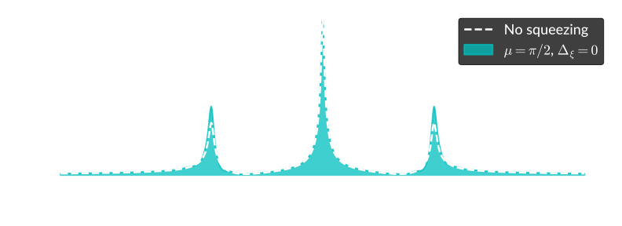

Anti squeeze phase &Rightarrow; narrow sidebands

$$T=4\gamma^{-1},\quad e^r=4,\quad N=3.52,\quad 12.04\mathrm{dB}$$

Summary
-------

* Weak measurements are everywhere
* We use POVMs to expose the salient properties of measurements
* Quantum noise provides helpful continuous-measurement framework
* We do quantum noise with qubits!
* Markovianity brings power problems
* We use an equation hierarchy to describe finite-bandwidth effects and overcome
  the power problems

Acknowledgments
---------------
