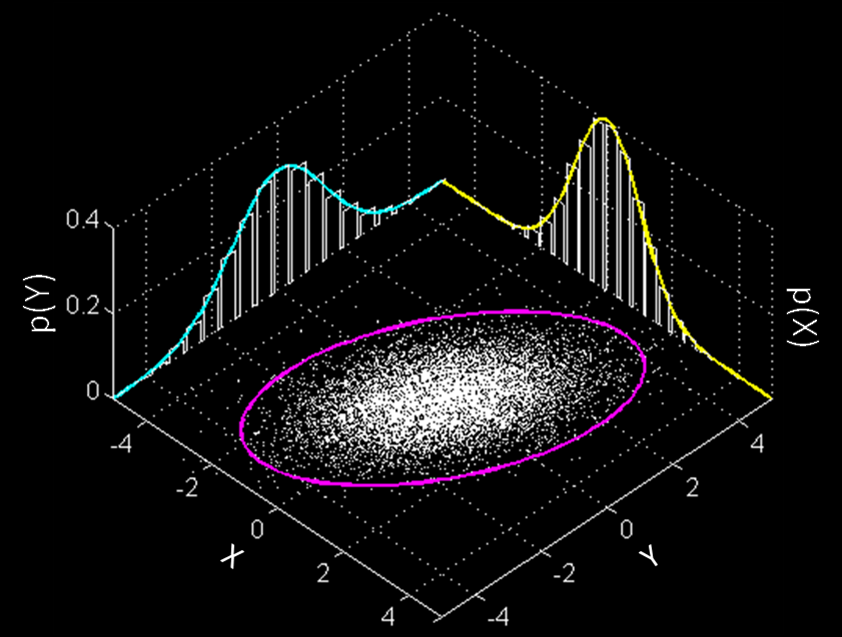

## Models have free parameters

{width=300px}

$$\mathbf{\theta}=(\theta^1,\ldots,\theta^N)$$

## Estimates are always noisy

{width=320px}

$$\text{Cov}\left(\hat{\mathbf{\theta}}\right)$$

## Fisher information reigns

{width=280px}

$$F_{jk}=
\int dx\frac{\partial_j\Pr(x|\mathbf{\theta})\,\partial_k\Pr(x|\mathbf{\theta})}
{\Pr(x|\mathbf{\theta})}$$

## Fisher information reigns

{width=280px}

$$\text{Cov}\left(\hat{\mathbf{\theta}}\right)\geq F^{-1}$$

## How about a single number?

$q=\sum_jq_jB^j$

<cite>*Optimal and secure measurement protocols for quantum sensor networks*,
Zachary Eldredge, Michael Foss-Feig, JAG, S. L. Rolston, and Alexey V.
Gorshkov, Phys. Rev. A **97**, 042337 (2018)</cite>

## How about a single number?

Identify $\theta^k$ and calculate $F_{kk}$, right?

<cite>*Optimal and secure measurement protocols for quantum sensor networks*,
Zachary Eldredge, Michael Foss-Feig, JAG, S. L. Rolston, and Alexey V.
Gorshkov, Phys. Rev. A **97**, 042337 (2018)</cite>

## WRONG!

You will calculate unattainable sensitivity goals.

You will construct estimators with unnecessary errors.

## &nbsp;{background-image="img/mtw.png"}

## Parameters define tangent vectors

{width=280px}

$$F_{jk}=
\int dx\frac{\partial_j\Pr(x|\mathbf{\theta})\,\partial_k\Pr(x|\mathbf{\theta})}
{\Pr(x|\mathbf{\theta})}$$

## Functions define differential forms

{width=280px}

$q=\theta^1+\frac{1}{2}\theta^2$

## Parameters define conditioning

{width=500px}

$(F_{kk})^{-1}$ bounds conditional variance

## Functions define marginalizing

{width=500px}

$(F^{-1})^{kk}$ bounds marginal variance

## Conditional isn't marginal

{width=500px}

$(F_{kk})^{-1}\neq(F^{-1})^{kk}$

## Quantum models define many distributions

$$\begin{aligned}
H(\mathbf{\theta})&=\sum_j\theta^jX_j
\\
\rho(\mathbf{\theta})&=e^{-itH(\mathbf{\theta})}\rho_0e^{itH(\mathbf{\theta})}
\\
\Pr(x|\mathbf{\theta})&=\operatorname{tr}[\rho(\mathbf{\theta})E_x]
\end{aligned}$$

## Optimize over choices

{width=300px}

$$\Vert\theta^k\Vert^2=\max_{\rho_0,\{E_x\}}F_{jj}$$

## Optimize over choices

{width=300px}

$$\Vert\theta^k\Vert^2=\max_{\rho_0,\{E_x\}}F_{jj}$$

## Optimize over choices

{width=300px}

$$\Vert\theta^k\Vert^2=\max_{\rho_0,\{E_x\}}F_{jj}$$

## We use norm to "marginalize"

{width=400px}

## Summary{background-image=img/E_PLURIBUS_UNUM.png}

Estimating a scalar function of many parameters is not a single-parameter
problem.

Relationship of differential form $dq$ to norm $\Vert\cdot\Vert$ gives best
sensitivity and optimal measurement (holds for arbitrary processes).

For more information on upcoming manuscript, see
[**unm.edu/~jagross/blog**](http://www.unm.edu/~jagross/blog)

